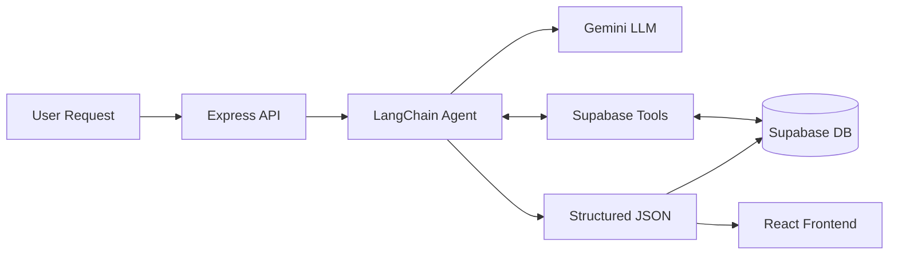

# Aldi Meal Planner 2.0 - Single Source of Truth (SSOT)

> **Last Updated:** December 20, 2025
> **Version:** 2.0 (AI-Native Architecture)

## 1. Project Overview

Aldi Meal Planner 2.0 is an AI-native web application designed to automate weekly meal planning and grocery list creation specifically for Aldi shoppers. It replaces brittle, rule-based algorithms with intelligent AI agents (LangChain + Google Gemini) to handle complex constraints like budget, dietary preferences, and variety.

### Core Goals

1. **Intelligent Automation:** Use AI to generate meal plans that strictly adhere to a weekly budget while maximizing variety.
2. **User Adaptability:** Learn from user ratings, preferences, and dietary restrictions without code changes.
3. **Explainability:** Provide clear reasoning for why specific recipes were chosen.
4. **Maintainability:** Reduce reliance on complex `if/else` logic by moving reasoning to LLM prompts.

### Target Audience

- Budget-conscious individuals/families.
- Aldi shoppers.
- Users needing structured meal planning (e.g., ADHD friendly).

---

## 2. Technical Stack

| Component | Technology | Version |
|-----------|------------|---------|
| **Frontend** | React, Vite, Tailwind CSS | React 19, Vite 5 |
| **Backend** | Node.js, Express.js | Node 18+ |
| **Database** | Supabase (PostgreSQL) | - |
| **AI Framework** | LangChain.js | v0.3+ |
| **LLM** | Google Gemini | 1.5 Pro |
| **Auth** | Supabase Auth | Google OAuth |
| **Styling** | Tailwind CSS | v3.4 |

---

## 3. Architecture

### High-Level Flow

### Directory Structure

- **`/src`**: Frontend React application (Pages, Components, Contexts).
- **`/backend`**: Express server and AI logic.
  - **`/ai/agents`**: Core AI agents (e.g., `mealPlanningAgent.js`).
  - **`/ai/tools`**: Tools for agents to access DB/APIs.
  - **`/supabase`**: Database clients.
  - **`/scrapers`**: Scripts to fetch prices/recipes.
- **`/scripts`**: Utility scripts for maintenance, data import, and testing.
- **`/docs`**: Project documentation.

---

## 4. AI Agents & Features

### 1. Meal Plan Generation Agent (Core)

- **Status:** Implemented (`backend/ai/agents/mealPlanningAgent.js`)
- **Function:** Generates 7-day plans based on budget, history, and pantry items.
- **Input:** Budget, User ID, Preferences.
- **Output:** Structured JSON with daily meals, costs, and reasoning.

### 2. Recipe Discovery Agent

- **Status:** Planned (Phase 2)
- **Function:** Finds new recipes via search or generation when variety is low.

### 3. Grocery List Optimizer Agent

- **Status:** Planned (Phase 3)
- **Function:** Consolidates ingredients and sorts by store aisle.

### 4. Ingredient Matching & Cost Agents

- **Status:** Planned
- **Function:** Resolves scraped ingredients to Aldi products and calculates precise costs.

---

## 5. Database Schema (Supabase)

Key tables include:
- **`recipes`**: Metadata, instructions, cost per serving.
- **`ingredients`**: Base ingredients with Aldi pricing data.
- **`recipe_ingredients`**: Junction table linking recipes to ingredients with quantities.
- **`meal_plans`**: Generated weekly plans linked to users.
- **`user_preferences`**: User dietary restrictions and likes/dislikes.
- **`user_ratings`**: Feedback loop for AI improvement.
- **`moderation_queue`**: For reviewing new/generated recipes.

*(See `docs/DATABASE_SCHEMA_SUPABASE.md` for full SQL)*

---

## 6. Development Workflow

### Setup

1. **Install:** `npm install`
2. **Env Vars:** Configure `.env` with Supabase and Google AI keys.
3. **Run:** `npm run dev` (Frontend) + `npm run dev:server` (Backend).

### Key Commands

- `npm run plan:generate`: Trigger meal plan generation (manual).
- `npm run scrape:prices`: Update ingredient prices.
- `npm run test`: Run test suite.
- `npm run migrate`: Apply database schema changes.

### Deployment

- **Frontend:** Vercel (Deployed from root).
- **Backend:** Render/Railway/Vercel Serverless (via `backend/` directory).

---

## 7. Roadmap & Status

| Phase | Feature | Status |
|-------|---------|--------|
| **1** | Core Meal Planning Agent | 🟡 In Progress / Partially Complete |
| **2** | Recipe Discovery Agent | 🔴 Pending |
| **3** | Grocery Optimizer | 🔴 Pending |
| **4** | User Feedback Loop | 🔴 Pending |
| **5** | Production Polish & Scaling | 🔴 Pending |

---

## 8. Documentation Index
- **PRD:** `.cursor/rules/ai_architecture_prd.mdc`
- **DB Schema:** `docs/DATABASE_SCHEMA_SUPABASE.md`
- **AI Guide:** `docs/LANGCHAIN_IMPLEMENTATION_GUIDE.md`
- **Project Structure:** `docs/PROJECT_STRUCTURE.md`

